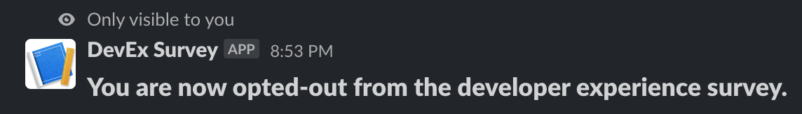

# Slack Developer Experience Surveys on AWS

## Box-ready serverless solution to run developer experience surveys on a scheduled (or one-off!) cadence

---

This project enables you to easily set up and run developer experience surveys on Slack.


While the core logic around calling Slack and configuring your questions is based on the library [devexbot](https://github.com/mikaelvesavuori/devexbot), the rest of the code bundles all the rest of the stuff into a complete solution and offers some extra functionality like:

- Read survey results back from the database in a readable fashion (see more below)
- Slack slash command support for opting in and out of the survey
- **Optional**: Write results to Google Sheets for easy visualization in Looker Studio

The questions (and number of them) is also configurable — see the [devexbot](https://github.com/mikaelvesavuori/devexbot) documentation for more.


## Solution


Code is written in [TypeScript](https://www.typescriptlang.org), is bundled with [esbuild](https://esbuild.github.io), and gets deployed with [Serverless Framework](https://www.serverless.com). Privileges are scoped down to the bare necessities. Errors are logged with [mikrolog](https://github.com/mikaelvesavuori/mikrolog).

The architecture is based on serverless components (Lambda, DynamoDB, EventBridge) and should be frictionless to manage and cheap to run.

Note that the functions for the webhook and slash command may be run quite frequently, as (especially) the webhook function is run every time a user interacts with elements in the Slack survey, such as clicking on a button.

Responses are not anonymous: They contain both the user ID and the user's name. Slack has a somewhat unclear model around names, but it seems to respond to the displayed name, at least.

## Behaviors

- Only users who have opted in (and are stored in DynamoDB) will receive a survey when it gets opened up for responses.




- When getting the survey results, you will get back a nice, question-keyed response. Please note, however, that the response's question keys will map to the _current_ questions, not any historical questions at the time of answering (as these are _not_ stored). This also means that if you are changing questions (especially if these are _totally_ different) between two points in time, then you should never trust any results from a period of time that crosses multiple question sets.
- It is not possible to close surveys in the current state of the implementation. Once a survey is opened, it stays open until the user acts on it. This does not seem like something that needs to be implemented - see below.
- The timestamp for each response is logged when it's caught by the function that handles it; this is very likely less than ~1 second after the user has submitted their response.
- When you retrieve responses you provide a `from` and a `to` parameter in the call. Effectively, if a user does not respond in a period of time it's simply _not a response at all_ - there is no need for any complex logic around survey IDs or such to track responses to certain iterations of a survey.

## Usage

### Installation

Install the dependencies with `npm install` or your equivalent command.

### Configuration

You will need to do a few things before actually deploying the code. If you want to support Google Sheets, make sure to read everything first (including the special steps below) before doing anything.

#### `devexbot` configuration

Use `src/config/SurveyConfiguration.json` as per the `devexbot` documentation.

#### Setting up your DevEx app in Slack

- [Create a Slack app](https://api.slack.com/authentication/basics). Set it to whatever name you want.
- In `Interactivity & Shortcuts`, enable this as well. _Once the solution is deployed, you'll need to set your endpoint to the "ReceiveWebhook" function here_.
- [Create a new slash command](https://api.slack.com/interactivity/slash-commands). I suggest using `/devex` as this is what the solution is looking for. _Here too you will need to set the request URL to the "SlashCommand" function when you've deployed the solution_.
- In `OAuth & Permissions`, make sure that the following scopes are enabled: `chat:write`, `commands`, and `users:read`. **Note down the "Bot User OAuth Token"**.

#### AWS secrets

- Create a new secret in AWS Secrets Manager, in the same region as the system will be deployed to. Make it an "other type of secret".
- Add two lines with their corresponding value:
  - `SLACK_AUTH_TOKEN` - The key to authorize your call to Slack
  - _If you need to support Google Sheets, see below, before saving!_
- Name the secret `DevExSurvey`.

#### Support for Google Sheets

If you want to output responses to a Google Sheets document, you need to do yet additional steps.

- You need a Google Cloud Platform account with a project.
- In that project, enable the Google Sheets API.
- Create an API key. Download the key as a JSON file.
- Copy the `private_key` and `client_email` values, and add these to the secret in AWS Secrets Manager:
  - `GOOGLE_SHEETS_DOCUMENT_ID` - The ID of the document (you see it as a long random string in the URL bar)
  - `GOOGLE_SHEETS_SERVICE_ACCOUNT_EMAIL` - The `client_email` from the JSON file
  - `GOOGLE_SHEETS_PRIVATE_KEY` - The `private_key` from the JSON file


Need more info? See [this article](https://theoephraim.github.io/node-google-spreadsheet/#/getting-started/authentication?id=service-account).

#### Bonus idea: Visualize responses in Looker Studio

If you already have the Google Sheets integration working, it's easy-peasy to take an extra 15 minutes and visualize the results in Looker Studio.


#### Setting the schedule

By default, the schedule is set to open the survey at 15:00 UTC/Zulu time every Friday. It's quite possible you need to change this time to be appropriate for your needs and your own time zone.

You can change this in `serverless.yml` under the `OpenSurvey` function, where the default value reads as:

```yml
- schedule: cron(0 15 ? * FRI *)
```

See AWS's page [Schedule Expressions for Rules](https://docs.aws.amazon.com/AmazonCloudWatch/latest/events/ScheduledEvents.html) for more. You can use the online [crontab guru](https://crontab.guru) to test your patterns since cron patterns can be a bit wonky if you haven't worked with them before.

#### Deployment and last fixes

- Update `serverless.yml` with your AWS account number in `custom.config.awsAccountNumber`.
- Deploy the solution with `npm run deploy`.
- Once this is done (should take 2-3 minutes), you'll end up with a set of URLs to the public synchronous functions. **Note down the values for `ReceiveWebhook` and `SlashCommand`**.
- Back on the [Slack API page](https://api.slack.com/), set these URL values in the `Interactivity & Shortcuts` and `Slash Commands` pages, respectively.

### Deployment

Deploy the solution with `npm run deploy` or your equivalent command.

### Remove project

Run `npm run teardown` or your equivalent command. _Note that DynamoDB tables are set to be retained, so that they aren't mistakenly deleted—these need to be manually removed afterwards._

## Example API calls

### Open the survey for all opted-in users

This is deactivated by default and uses a schedule (see above).

_You need to uncomment the section in `serverless.yml` to make this work over the API._

```bash
curl {{BASE_URL}}/open
```

### Opt in/opt out user (Slack "slash" command)

This is an example of how the payload from Slack looks. Notice that the `text` field will be `optin` or `optout`.

```bash
curl {{BASE_URL}}/slash
```

```json
{
  "token": "SOME_TOKEN_HERE",
  "team_id": "TXXXXXXXXXX",
  "team_domain": "teamname",
  "channel_id": "CXXXXXXXXXX",
  "channel_name": "some_channel",
  "user_id": "UXXXXXXXXXX",
  "user_name": "sam_person",
  "command": "/devex",
  "text": "optin",
  "api_app_id": "AXXXXXXXXXX",
  "is_enterprise_install": "false",
  "response_url": "https://hooks.slack.com/commands/TXXXXXXXXXX/1234123412341/RANDOM",
  "trigger_id": "1234123412341.1234123412341.SHA"
}
```

### Get survey responses

You will need to supply a period with `from` and `to` values in `YYYYMMDD` format.

The `from` value counts from the first millisecond of the UTC/Zulu time, and `to` is from the last millisecond of the provided day.

```bash
curl {{BASE_URL}}/responses?from=20230601&to=20230630
```

You can also add a positive or negative offset in hours, with the `offset` value.

```bash
curl {{BASE_URL}}/responses?from=20230601&to=20230630&offset=4  # Positive offset
curl {{BASE_URL}}/responses?from=20230601&to=20230630&offset=-2 # Negative offset
```

An example response could look like:

```json
{
  "*1. How has your day been?*": {
    "negative": "50.0000%",
    "positive": "50.0000%"
  },
  "*2. Did you make progress toward your goals today?*\nConsider the clarity of goals, how engaging the work is, your control of the structure of work...": {
    "negative": "33.3333%",
    "neutral": "33.3333%",
    "positive": "33.3333%"
  },
  "*3. Have you been able to focus today?*\nConsider the number of meetings, interruptions, unplanned work...": {
    "negative": "33.3333%",
    "neutral": "16.6667%",
    "positive": "50.0000%"
  },
  "*4. Is your tooling working well and fast?*\nConsider CI, code tools, platform tools, build and test times, code review times...": {
    "negative": "33.3333%",
    "neutral": "50.0000%",
    "positive": "16.6667%"
  },
  "*5. Is the cognitive load manageable?*\nConsider project complexity, friction, processes, communication...": {
    "negative": "50.0000%",
    "neutral": "16.6667%",
    "positive": "33.3333%"
  }
}
```

## Feel free to contribute!

This is a version 1.0 of this. If you find it useful, or if you find odd cases that aren't handled, just go ahead and make a pull request so we can look at a solution together.

---

## References

### Developer experience surveys

- [The SPACE of Developer Productivity](https://queue.acm.org/detail.cfm?id=3454124)
- [DevEx: What Actually Drives Productivity](https://queue.acm.org/detail.cfm?id=3595878)
- [Octoverse Spotlight 2021: The Good Day Project—Personal analytics to make your work days better](https://github.blog/2021-05-25-octoverse-spotlight-good-day-project/)
- [Abi Noda on Substack](https://substack.com/@abinoda)

### Slack

- [Reference: Block elements](https://api.slack.com/reference/block-kit/block-elements#button)
- [Creating interactive messages](https://api.slack.com/messaging/interactivity)
- [Handling user interaction in your Slack apps](https://api.slack.com/interactivity/handling)
